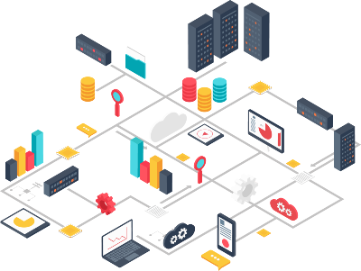

# 1️⃣ Fundamentos del Cloud Computing y la nube pública

{align="right"}

En los últimos 15 años, la informática ha vivido una de sus transformaciones más profundas: el paso de los sistemas tradicionales en local (on-premise) al Cloud Computing.

Hoy en día, prácticamente todas las empresas, desde grandes multinacionales hasta startups emergentes, utilizan la nube pública para alojar aplicaciones, gestionar datos, desplegar servicios o incluso entrenar modelos de inteligencia artificial. La nube pública no es solo una tendencia, es el estándar de la industria.

Por ello, conocer sus fundamentos es esencial para cualquier profesional de la informática. Ejemplos cotidianos de uso de la nube pública:

    📨 Gmail y Outlook → SaaS en la nube.    

    🎞️ Netflix, Spotify o Disney+ → Streaming sobre plataformas cloud escalables.

    🪧 WhatsApp o Telegram → infraestructuras distribuidas en centros de datos.

    🕹️ Videojuegos online → servidores alojados en AWS, Azure o GCP.

    
!!!note "A todo esto se le llama Cloud Computing"

Vale, todo esto está genial pero...

## ¿Cómo ha evolucionado todo esto?

!!!bug "Modelo tradicional (on-premise)"

- Las empresas compraban servidores físicos y los alojaban en su propia sala de informática o CPD (Centro de Procesamiento de Datos).
- El coste inicial era muy alto (hardware, licencias, climatización, electricidad, personal de mantenimiento).
- Escalar era lento: si la demanda crecía, había que comprar más máquinas.
- Riesgo de infrautilización: servidores encendidos las 24h aunque se usaran poco.

!!!tip "Modelo cloud"

- Los recursos se solicitan a través de Internet en cuestión de minutos.
- Escalabilidad casi ilimitada: se pueden añadir más servidores virtuales de forma automática.
- Pago ajustado al consumo: como una factura de luz o agua.
- El proveedor se encarga del mantenimiento físico, seguridad y disponibilidad.

Para que nos hagamo una idea, los tiempos de evolución de la informática en cuestión de servidores están clasificados de la siguiente manera:

    🗃️ Mainframes (años 60-70): grandes ordenadores centrales a los que se conectaban terminales “tontas”. Toda la capacidad de cómputo estaba centralizada.

    💻 Servidores propios (años 80-90): las empresas compraban y mantenían sus propios servidores para correo, archivos o bases de datos.

    🥽 Virtualización (años 2000): permitió dividir un único servidor físico en varios “servidores virtuales”, aprovechando mejor el hardware.

    ☁️ La nube (años 2010 en adelante): los grandes proveedores comenzaron a ofrecer servicios masivos de infraestructura y aplicaciones accesibles desde cualquier lugar del mundo.

## Características esenciales del Cloud Computing
{align="center"}
/// caption
///

Según el NIST (National Institute of Standards and Technology), el Cloud Computing se reconoce por cinco características principales:

**Autoservicio bajo demanda**

    Los usuarios pueden aprovisionar recursos por sí mismos, sin necesidad de pedirlo a un administrador.
    👉 Ejemplo: crear una nueva máquina virtual en AWS en cuestión de minutos.

**Acceso ubicuo a través de la red**

    Los servicios están disponibles en cualquier momento y desde cualquier dispositivo conectado a Internet.
    👉 Ejemplo: abrir tus fotos en Google Fotos desde el móvil, la tablet o el ordenador.

**Elasticidad y escalabilidad**

    Los recursos pueden crecer o disminuir automáticamente según la demanda.
    👉 Ejemplo: Netflix amplía su capacidad en horas punta y la reduce en horarios de baja actividad.

**Pago por uso**
    
    No hay un coste fijo elevado, sino que se paga solo por los recursos realmente utilizados.
    👉 Ejemplo: pagar almacenamiento extra en Google Drive solo cuando lo necesitas.

**Recursos compartidos**
    
    Los proveedores utilizan centros de datos donde los recursos se comparten entre múltiples clientes, de manera aislada y segura.
    👉 Ejemplo: Dropbox aloja los archivos de millones de usuarios en sus servidores.

---

## 😾 Actividades

1. Haz una lista de las aplicaciones que usas a diario. Señala cuáles dependen de la nube y cuáles funcionan sin conexión. ¿Qué diferencias notas entre ambas?

2. Imagina que montas una web de reservas de restaurantes. ¿Qué pasaría si la alojas en un servidor propio y de repente 10.000 personas entran a reservar al mismo tiempo? ¿Cómo lo solucionaría la nube?