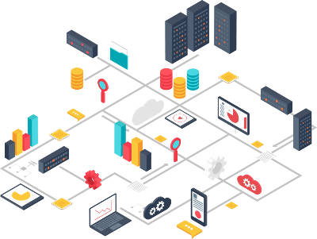

# 1️⃣ Fundamentos del Cloud Computing y la nube pública

{align="right"}

En los últimos 15 años, la informática ha vivido una de sus transformaciones más profundas: el paso de los sistemas tradicionales en local (on-premise) al Cloud Computing.

Hoy en día, prácticamente todas las empresas, desde grandes multinacionales hasta startups emergentes, utilizan la nube pública para alojar aplicaciones, gestionar datos, desplegar servicios o incluso entrenar modelos de inteligencia artificial. La nube pública no es solo una tendencia, es el estándar de la industria.

Por ello, conocer sus fundamentos es esencial para cualquier profesional de la informática. Ejemplos cotidianos de uso de la nube pública:

    📨 Gmail y Outlook → SaaS en la nube.    

    🎞️ Netflix, Spotify o Disney+ → Streaming sobre plataformas cloud escalables.

    🪧 WhatsApp o Telegram → infraestructuras distribuidas en centros de datos.

    🕹️ Videojuegos online → servidores alojados en AWS, Azure o GCP.

    
!!!note "A todo esto se le llama Cloud Computing"

Vale, todo esto está genial pero...

## ¿Cómo ha evolucionado todo esto?

!!!bug "Modelo tradicional (on-premise)"

- Las empresas compraban servidores físicos y los alojaban en su propia sala de informática o CPD (Centro de Procesamiento de Datos).
- El coste inicial era muy alto (hardware, licencias, climatización, electricidad, personal de mantenimiento).
- Escalar era lento: si la demanda crecía, había que comprar más máquinas.
- Riesgo de infrautilización: servidores encendidos las 24h aunque se usaran poco.

!!!tip "Modelo cloud"

- Los recursos se solicitan a través de Internet en cuestión de minutos.
- Escalabilidad casi ilimitada: se pueden añadir más servidores virtuales de forma automática.
- Pago ajustado al consumo: como una factura de luz o agua.
- El proveedor se encarga del mantenimiento físico, seguridad y disponibilidad.

Para que nos hagamo una idea, los tiempos de evolución de la informática en cuestión de servidores están clasificados de la siguiente manera:

    🗃️ Mainframes (años 60-70): grandes ordenadores centrales a los que se conectaban terminales “tontas”. Toda la capacidad de cómputo estaba centralizada.

    💻 Servidores propios (años 80-90): las empresas compraban y mantenían sus propios servidores para correo, archivos o bases de datos.

    🥽 Virtualización (años 2000): permitió dividir un único servidor físico en varios “servidores virtuales”, aprovechando mejor el hardware.

    ☁️ La nube (años 2010 en adelante): los grandes proveedores comenzaron a ofrecer servicios masivos de infraestructura y aplicaciones accesibles desde cualquier lugar del mundo.

## ¿Qué es el Cloud Computing?

El Cloud Computing (computación en la nube) es un modelo tecnológico que permite ofrecer recursos informáticos —como servidores, almacenamiento, bases de datos, redes, software o inteligencia artificial— a través de Internet, de manera bajo demanda y generalmente con un modelo de pago por uso.

En lugar de adquirir y mantener infraestructura física propia, las organizaciones pueden alquilar recursos en centros de datos gestionados por proveedores especializados. Esto democratiza la tecnología: empresas pequeñas pueden acceder a la misma potencia que las grandes multinacionales sin necesidad de inversiones millonarias.

!!!warning "Ejemplos cotidianos"
    🟢 WhatsApp no necesita que cada usuario monte un servidor: todo está en la nube.

    🎬 Netflix aloja su plataforma en Amazon Web Services (AWS) para atender millones de usuarios simultáneamente.

    📦 Google Drive permite guardar y sincronizar archivos sin necesidad de discos duros externos.

## Evolución del modelo tradicional al Cloud Computing

**Modelo tradicional (on-premise)**

    Las empresas compraban servidores físicos y los alojaban en su propia sala de informática o CPD (Centro de Procesamiento de Datos).
    
    El coste inicial era muy alto (hardware, licencias, climatización, electricidad, personal de mantenimiento).
    
    Escalar era lento: si la demanda crecía, había que comprar más máquinas.
    
    Riesgo de infrautilización: servidores encendidos las 24h aunque se usaran poco.

**Modelo cloud**

    Los recursos se solicitan a través de Internet en cuestión de minutos.
    
    Escalabilidad casi ilimitada: se pueden añadir más servidores virtuales de forma automática.
    
    Pago ajustado al consumo: como una factura de luz o agua.
    
    El proveedor se encarga del mantenimiento físico, seguridad y disponibilidad.

## Características esenciales del Cloud Computing
{align="center"}
/// caption
///

Según el NIST (National Institute of Standards and Technology), el Cloud Computing se reconoce por cinco características principales:

**Autoservicio bajo demanda**

    Los usuarios pueden aprovisionar recursos por sí mismos, sin necesidad de pedirlo a un administrador.
    👉 Ejemplo: crear una nueva máquina virtual en AWS en cuestión de minutos.

**Acceso ubicuo a través de la red**

    Los servicios están disponibles en cualquier momento y desde cualquier dispositivo conectado a Internet.
    👉 Ejemplo: abrir tus fotos en Google Fotos desde el móvil, la tablet o el ordenador.

**Elasticidad y escalabilidad**

    Los recursos pueden crecer o disminuir automáticamente según la demanda.
    👉 Ejemplo: Netflix amplía su capacidad en horas punta y la reduce en horarios de baja actividad.

**Pago por uso**
    
    No hay un coste fijo elevado, sino que se paga solo por los recursos realmente utilizados.
    👉 Ejemplo: pagar almacenamiento extra en Google Drive solo cuando lo necesitas.

**Recursos compartidos**
    
    Los proveedores utilizan centros de datos donde los recursos se comparten entre múltiples clientes, de manera aislada y segura.
    👉 Ejemplo: Dropbox aloja los archivos de millones de usuarios en sus servidores.

## Tipos de nube

**Nube pública**

    infraestructura de un proveedor externo accesible por Internet. Ej: AWS, Azure, Google Cloud.

**Nube privada**

    infraestructura exclusiva para una organización, ya sea en sus instalaciones o en un proveedor dedicado.

**Nube híbrida**
    
    combina nube privada y pública, compartiendo datos y aplicaciones.

**Nube comunitaria**

    compartida por varias organizaciones con intereses comunes (ej. universidades, administraciones públicas).

## Ventajas generales de la nube

El uso de la nube pública trae consigo múltiples beneficios:

- **Flexibilidad** adaptarse rápidamente a nuevas necesidades sin comprar equipos.
- **Accesibilidad** servicios disponibles desde cualquier lugar del mundo.
- **Reducción de costes iniciales** ya no hace falta invertir en servidores propios.
- **Escalabilidad** posibilidad de ampliar recursos en cuestión de segundos.
- **Actualización constante** el proveedor se encarga de mantener y actualizar los sistemas.

!!!note "Ejemplo práctico"
    una startup que desarrolla una aplicación móvil puede empezar usando servidores gratuitos de Google Cloud y, si su aplicación tiene éxito, escalar fácilmente a millones de usuarios.

## Retos iniciales y barreras

Aunque la nube es una solución poderosa, también presenta desafíos:

🛟**Seguridad y confianza**
    
    almacenar datos en servidores de terceros puede generar dudas sobre la privacidad.

🌐 **Dependencia de Internet**

    sin conexión, no hay acceso al servicio.

💵 **Control de costes**

    el pago por uso puede ser un arma de doble filo si no se controla el consumo.

🛜 **Dependencia del proveedor**

    suna vez migrados los datos, no siempre es fácil cambiarlos de un proveedor a otro.

!!!tip "Ejemplo"
    una empresa que se pasa a AWS puede tener problemas si en el futuro quiere migrar a Azure, debido a la compatibilidad de servicios.

## Principales proveedores de nube pública

- Amazon Web Services (AWS): pionero y líder en el mercado.
- Microsoft Azure: integración con entornos empresariales y servicios Windows.
- Google Cloud Platform (GCP): destaca en análisis de datos, Big Data y Kubernetes.
- Otros: IBM Cloud, Oracle Cloud, DigitalOcean.

---

## 😾 Actividades

1️⃣ Haz una lista de las aplicaciones que usas a diario. Señala cuáles dependen de la nube y cuáles funcionan sin conexión. ¿Qué diferencias notas entre ambas?

2️⃣ Imagina que montas una web de reservas de restaurantes. ¿Qué pasaría si la alojas en un servidor propio y de repente 10.000 personas entran a reservar al mismo tiempo? ¿Cómo lo solucionaría la nube?

3️⃣ De la siguiente lista, indicad qué servicios funcionan gracias a la nube y cuáles dependen principalmente de instalación local:

      - Gmail
      - Netflix
      - Dropbox
      - WhatsApp
      - Microsoft Word (a través de un instalador ejecutable)
      - Steam
      - Google Fotos

4️⃣ Visita la web de AWS, Azure y GCP. Investiga acerca de las siguientes cuestiones:

      - ¿Qué servicios gratuitos ofrecen en sus cuentas iniciales?
      - ¿Cuánto tiempo dura el período gratuito?
      - ¿Qué limitaciones tienen?

5️⃣ ¿Cloud o servidor propio?

Una pequeña empresa tiene estas necesidades:

* Una página web corporativa con 500 visitas al día.
* Una aplicación de reservas que puede recibir 20.000 visitas durante una campaña.
* Una base de datos con información confidencial.
* Un sistema de archivos utilizado únicamente por 10 empleados.
* Una aplicación que debe estar disponible las 24 horas.

Para cada caso:

1. ¿Elegirías infraestructura propia, nube pública, nube privada o una solución híbrida?
2. Justifica tu decisión.
3. ¿Qué ventaja de la nube sería especialmente importante en cada caso?

---

6️⃣ La nube bajo presión ☁️🔥

Imagina que eres responsable de infraestructura de una tienda online.

Normalmente recibe **100 visitas simultáneas**, pero durante el Black Friday llegan **50.000**.

El servidor actual solamente puede atender unas 500 conexiones simultáneas.

Responde:

1. ¿Qué problemas podrían aparecer?
2. ¿Qué ocurriría si utilizáramos únicamente un servidor físico?
3. ¿Cómo podría ayudarnos la escalabilidad de la nube?
4. ¿Qué podría ocurrir cuando terminara el Black Friday?
5. ¿Qué característica del Cloud Computing estamos aprovechando?

**Objetivo:** entender la elasticidad sin necesidad de configurar todavía ningún servicio real.

---

7️⃣ ¿Cuánto pagarías por tu propio Netflix? 🎬

Imagina que quieres crear una plataforma de vídeo para tu instituto.

Necesitas:

* almacenar 5 TB de vídeos;
* servir vídeos a 1.000 alumnos;
* disponer de la plataforma 24 horas;
* realizar copias de seguridad;
* aumentar la capacidad durante los exámenes.

Compara dos soluciones:

**A. Servidor propio**

* compra del servidor;
* discos;
* conexión a Internet;
* electricidad;
* mantenimiento;
* copias de seguridad.

**B. Nube pública**

Investiga qué servicios de AWS, Azure o GCP podrían utilizarse.

Después responde:

> ¿Qué solución elegirías y por qué?

No es necesario calcular un precio exacto. Lo importante es identificar **qué recursos habría que pagar en cada modelo**.

---

8️⃣ ¿Quién tiene realmente tus datos? 🔐

Elige **tres servicios** que utilices habitualmente, por ejemplo Google Drive, Instagram, WhatsApp, OneDrive, Spotify, etc.

Para cada uno, investiga:

* ¿Dónde se almacenan los datos?
* ¿Quién proporciona la infraestructura?
* ¿Qué ocurre con tus datos si pierdes la contraseña?
* ¿Puedes descargar tus datos?
* ¿Puedes utilizar el servicio sin conexión?
* ¿Qué ocurre si la empresa deja de ofrecer el servicio?

Finalmente, responde:

> ¿Qué ventajas y riesgos tiene almacenar nuestros datos en la nube?

Esta puede dar bastante juego para debatir en clase.

---

9️⃣ El reto de los tres proveedores 🏆

Divide la clase en grupos.

Cada grupo recibe una empresa ficticia:

> **SurfApp** es una startup que acaba de crear una aplicación para reservar clases de surf. Espera comenzar con 1.000 usuarios, pero podría llegar a 1 millón.

Cada grupo debe elegir entre **AWS, Azure y Google Cloud**.

Deben investigar:

* servicios disponibles;
* almacenamiento;
* máquinas virtuales;
* bases de datos;
* herramientas de escalabilidad;
* servicios gratuitos;
* precios aproximados;
* ventajas y desventajas.

---

1️⃣0️⃣ ¿Qué modelo de nube es? 🕵️

Indica si cada situación corresponde principalmente a **nube pública, privada, híbrida o comunitaria**.

**A.** Una universidad comparte una infraestructura cloud entre varias universidades para proyectos de investigación.

**B.** Un banco mantiene determinados datos en sus propios servidores, pero utiliza AWS para alojar su página web.

**C.** Una empresa utiliza exclusivamente infraestructura cloud a la que acceden sus empleados.

**D.** Un hospital dispone de una infraestructura cloud utilizada exclusivamente por la organización.

**E.** Varias administraciones públicas comparten una infraestructura diseñada específicamente para ellas.

Después, inventa **una situación diferente para cada tipo de nube**.

---

1️⃣1️⃣ El apagón mundial ⚡

Imagina que mañana durante **6 horas no funciona Internet**.

¿Qué cosas dejarían de funcionar o tendrían problemas?

Haz una lista de **10 servicios** que utilizas habitualmente y clasifícalos:

| Servicio | ¿Funciona sin Internet? | ¿Depende de la nube? |
| -------- | ----------------------- | -------------------- |
| Spotify  | ❌/✅                     | ❌/✅                  |
| ...      |                         |                      |

Después responde:

> ¿La nube hace que dependamos más de Internet?

---

1️⃣2️⃣ Detectives del Cloud 🔎

Busca información sobre una aplicación o servicio que utilices habitualmente.

Por ejemplo:

* Spotify
* Netflix
* TikTok
* Discord
* Steam
* Google Drive
* Instagram
* Roblox
* WhatsApp

Averigua **qué infraestructura cloud utiliza**, si es posible.

El trabajo debe incluir:

1. Nombre del servicio.
2. Para qué utiliza la nube.
3. Qué proveedor o proveedores utiliza.
4. Qué ocurriría si aumentase repentinamente el número de usuarios.
5. Una curiosidad sobre su infraestructura.

**Bonus:** encontrar una noticia o artículo técnico que hable de su infraestructura.

---

1️⃣3️⃣ Diseña tu propia nube ☁️

Imagina que eres el responsable de informática de un instituto.

El centro necesita:

* almacenamiento para profesores;
* almacenamiento para alumnos;
* correo electrónico;
* página web;
* copias de seguridad;
* aulas virtuales;
* videoconferencias;
* acceso desde casa.

Diseña una solución indicando:

* qué servicios estarían en la nube;
* cuáles podrían mantenerse localmente;
* qué datos deberían protegerse especialmente;
* qué proveedor elegirías;
* qué ventajas tendría tu solución;
* qué riesgos tendría.

Puedes representarlo mediante un **diagrama**.

---

1️⃣4️⃣ La batalla de la nube ⚔️

Dividir la clase en tres grupos:

* 🟠 **AWS**
* 🔵 **Azure**
* 🔴 **Google Cloud**

Cada grupo tiene que defender su plataforma frente a las otras dos.

Deben preparar:

* 3 ventajas;
* 2 inconvenientes;
* 3 servicios interesantes;
* un ejemplo de empresa que la utilice;
* una razón para elegirla frente a las otras.

Después se hace un pequeño debate.

**Regla:** no vale decir simplemente "es mejor". Hay que justificarlo.

---

1️⃣5️⃣ ¿Verdadero o falso? 🚨

Indica si las siguientes afirmaciones son verdaderas o falsas y **justifica las falsas**:

1. La nube significa que los datos están almacenados en Internet.
2. Utilizar la nube significa no tener servidores físicos.
3. AWS, Azure y Google Cloud son proveedores de nube pública.
4. La nube siempre es más barata que tener servidores propios.
5. Una aplicación cloud puede aumentar sus recursos cuando aumenta la demanda.
6. La nube elimina todos los problemas de seguridad.
7. Para utilizar cualquier servicio cloud necesitamos conexión a Internet.
8. Una empresa puede utilizar simultáneamente varios proveedores cloud.
9. Cloud Computing y almacenamiento en la nube significan exactamente lo mismo.
10. Una máquina virtual puede ejecutarse sobre un servidor físico.

---

1️⃣6️⃣ 🧑‍💼 Eres el responsable de IT

> **Una empresa te contrata como responsable de informática.**

La empresa tiene 30 empleados y actualmente dispone de:

* 2 servidores físicos;
* 1 servidor de archivos;
* 1 servidor web;
* 1 servidor de bases de datos;
* 10 TB de almacenamiento;
* copias de seguridad en discos externos.

Los servidores tienen 6 años y empiezan a quedarse obsoletos.

La dirección te pregunta:

> **"¿Compramos servidores nuevos o migramos a la nube?"**

Debes preparar una propuesta de **una página** para la dirección.

Debe incluir:

* situación actual;
* ventajas de mantener infraestructura propia;
* ventajas de migrar a la nube;
* inconvenientes de cada opción;
* solución que propones;
* proveedor que elegirías;
* qué servicios migrarías;
* qué mantendrías localmente;
* conclusión final.

**No hay una única respuesta correcta.** Se valorará especialmente la capacidad de justificar las decisiones.

---