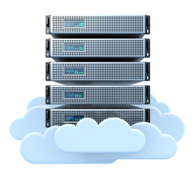

# 🏡 Bienvenid@s

{align="right"}

Vivimos en una época en la que la informática y las telecomunicaciones están en constante transformación. Uno de los cambios más importantes de los últimos años ha sido la adopción masiva del Cloud Computing, o computación en la nube. Este modelo ha cambiado radicalmente la forma en que personas, empresas y organizaciones gestionan sus recursos tecnológicos.

Cuando hablamos de “la nube”, nos referimos a la posibilidad de acceder a recursos informáticos a través de Internet: almacenamiento, servidores, bases de datos, redes, inteligencia artificial o aplicaciones completas. En lugar de comprar y mantener un servidor físico, ahora es posible “alquilar” en la nube lo que necesitamos, durante el tiempo que lo necesitemos, pagando únicamente por el uso real.

La nube pública es el modelo más extendido. En ella, grandes proveedores como Amazon Web Services (AWS), Microsoft Azure o Google Cloud Platform ponen a disposición de cualquier usuario enormes centros de datos distribuidos por todo el mundo. Gracias a este modelo, servicios que usamos a diario como Gmail, Netflix, Spotify, WhatsApp o Dropbox pueden funcionar de manera estable, escalable y global.

Esta asignatura tiene como propósito que el alumnado comprenda:

- Qué es el Cloud Computing y cómo ha transformado el sector tecnológico.
- En qué consiste la nube pública y qué la diferencia de otros modelos como la nube privada o híbrida.
- Los distintos niveles de servicio: IaaS (infraestructura), PaaS (plataforma) y SaaS (software).
- Las ventajas de la nube pública (flexibilidad, costes, disponibilidad) y también sus retos (seguridad, dependencia de proveedores, control de costes).
- Los principales actores del mercado y los servicios básicos que ofrecen.

Además de la parte teórica, se realizarán actividades prácticas que permitirán al alumnado experimentar directamente con entornos gratuitos de la nube pública, desplegando servicios sencillos y comprendiendo cómo se gestionan los recursos en este nuevo paradigma.

El conocimiento adquirido en esta materia será fundamental para desenvolverse en el mundo laboral actual, donde la nube se ha convertido en una herramienta imprescindible tanto para grandes empresas como para pequeños negocios e incluso proyectos personales.

!!!alert "En definitiva..."
    esta asignatura no solo es una introducción técnica, sino también una invitación a reflexionar sobre cómo la nube pública está presente en nuestro día a día y cómo será parte central de nuestra futura profesión.

## 📘 Recursos de Aprendizaje

RA1. Comprender los fundamentos del Cloud Computing

    - Explica qué es la computación en la nube y su evolución respecto al modelo tradicional on-premise.
    - Identifica las características esenciales: autoservicio bajo demanda, elasticidad, pago por uso, etc.

RA2. Diferenciar los tipos de nube

    - Reconoce las diferencias entre nube pública, privada, híbrida y comunitaria.
    - Justifica casos de uso y ventajas/desventajas de cada modelo.

RA3. Identificar los modelos de servicio en la nube

    - Distingue entre IaaS, PaaS y SaaS.

    - Clasifica servicios y aplicaciones reales en cada modelo.

RA4. Conocer a los principales proveedores de nube pública

    - Reconoce los servicios más utilizados de AWS, Azure y Google Cloud.
    - Evalúa sus similitudes y diferencias a nivel de enfoque y servicios gratuitos.

RA5. Valorar ventajas y limitaciones de la nube pública

    - Analiza beneficios: reducción de costes, escalabilidad, disponibilidad.
    - Explica riesgos y retos: seguridad, cumplimiento legal, dependencia del proveedor.

RA6. Utilizar servicios básicos en la nube pública

    - Accede a una cuenta gratuita en un proveedor cloud.
    - Despliega recursos básicos (máquina virtual, aplicación sencilla, almacenamiento en la nube).

RA7. Aplicar buenas prácticas de seguridad y control de costes

    - Reconoce el modelo de responsabilidad compartida.
    - Identifica estrategias para controlar costes y proteger datos en la nube.

RA8. Integrar conocimientos en un proyecto sencillo

    - Realiza un despliegue práctico en la nube pública (ej. página web básica, almacenamiento de archivos, aplicación en PaaS).
    - Documenta el proceso y presenta conclusiones.

## 📊 Evaluación de la asignatura

La calificación final se calculará con los siguientes porcentajes:

### 30% Actividades y prácticas

- Participación en debates, ejercicios de clasificación, comparativas de servicios.
- Prácticas de uso de cuentas gratuitas en proveedores cloud.
- Proyecto final (incluido dentro de actividades).

### 10% Actitud del alumno

- Asistencia y puntualidad.
- Colaboración en el trabajo en grupo.
- Respeto de normas y actitud proactiva en clase.

### 60% Exámenes

- Pruebas escritas teórico-prácticas sobre los contenidos de los temas.
- Preguntas de desarrollo, tipo test, resolución de casos y análisis comparativos.
- Al menos un examen parcial y un examen final.